# Sockudo 時序圖

> 本文檔使用 [Mermaid](https://mermaid.js.org/) 語法繪製時序圖，描述 Sockudo 的核心流程。

---

## 目錄

- [1. WebSocket 連線建立](#1-websocket-連線建立)
- [2. 公開頻道訂閱](#2-公開頻道訂閱)
- [3. 私有頻道認證與訂閱](#3-私有頻道認證與訂閱)
- [4. Presence 頻道訂閱](#4-presence-頻道訂閱)
- [5. 透過 HTTP API 觸發事件](#5-透過-http-api-觸發事件)
- [6. 客戶端事件傳遞](#6-客戶端事件傳遞)
- [7. Webhook 通知流程](#7-webhook-通知流程)
- [8. Delta 壓縮流程](#8-delta-壓縮流程)
- [9. 標籤過濾流程](#9-標籤過濾流程)
- [10. 多節點水平擴展（Redis 適配器）](#10-多節點水平擴展redis-適配器)
- [11. 使用者認證流程](#11-使用者認證流程)
- [12. 完整應用整合流程（以 Laravel 為例）](#12-完整應用整合流程以-laravel-為例)

---

## 1. WebSocket 連線建立

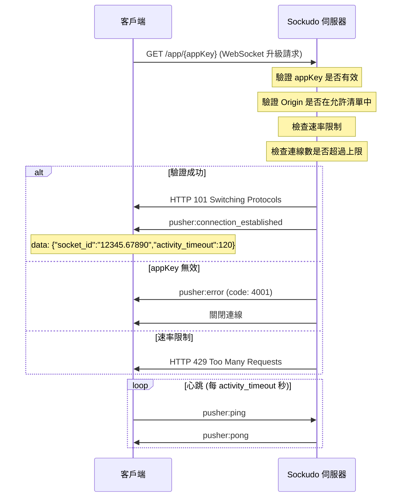

---

## 2. 公開頻道訂閱

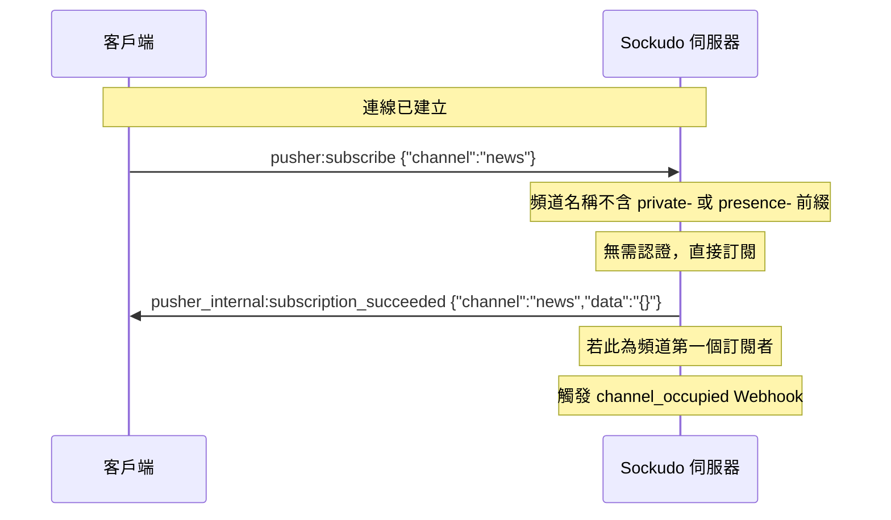

---

## 3. 私有頻道認證與訂閱

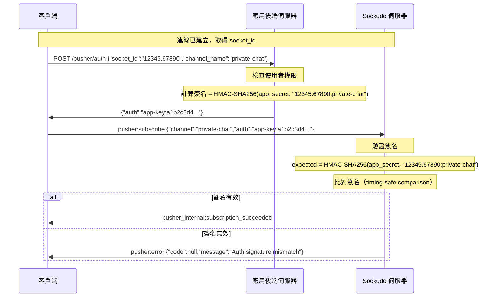

---

## 4. Presence 頻道訂閱

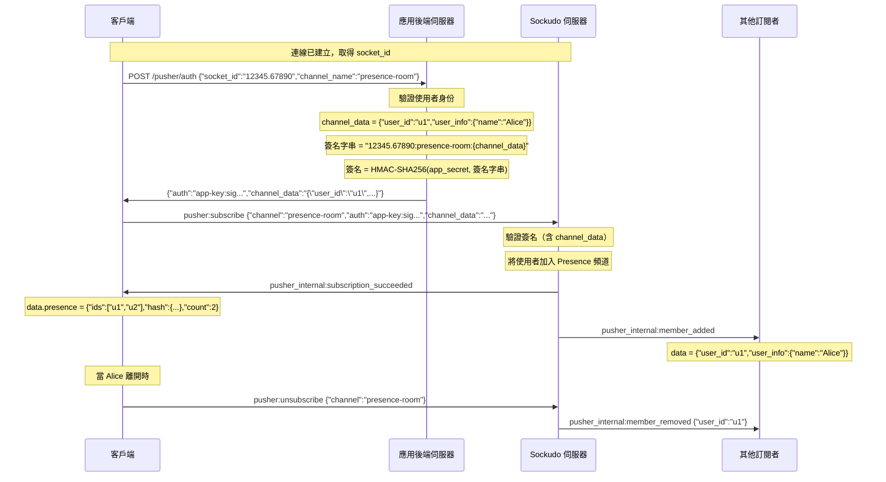

---

## 5. 透過 HTTP API 觸發事件

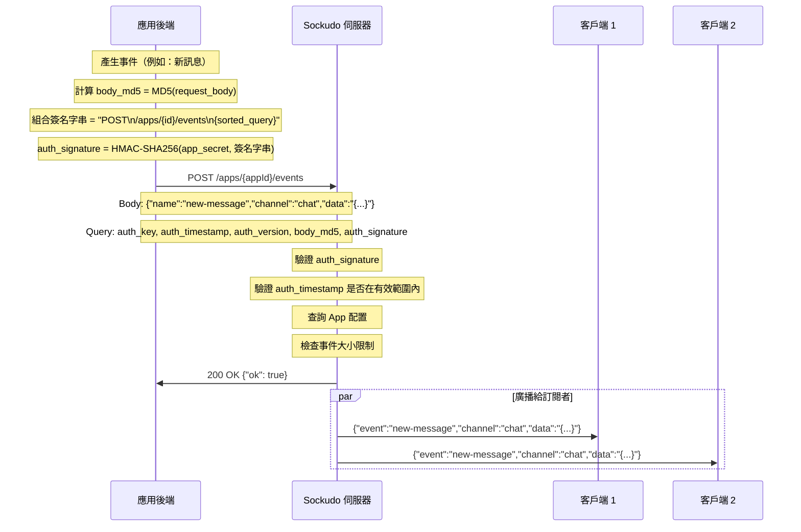

---

## 6. 客戶端事件傳遞

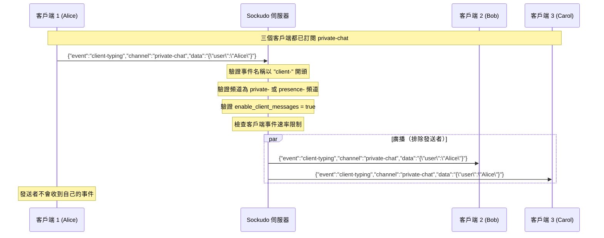

---

## 7. Webhook 通知流程

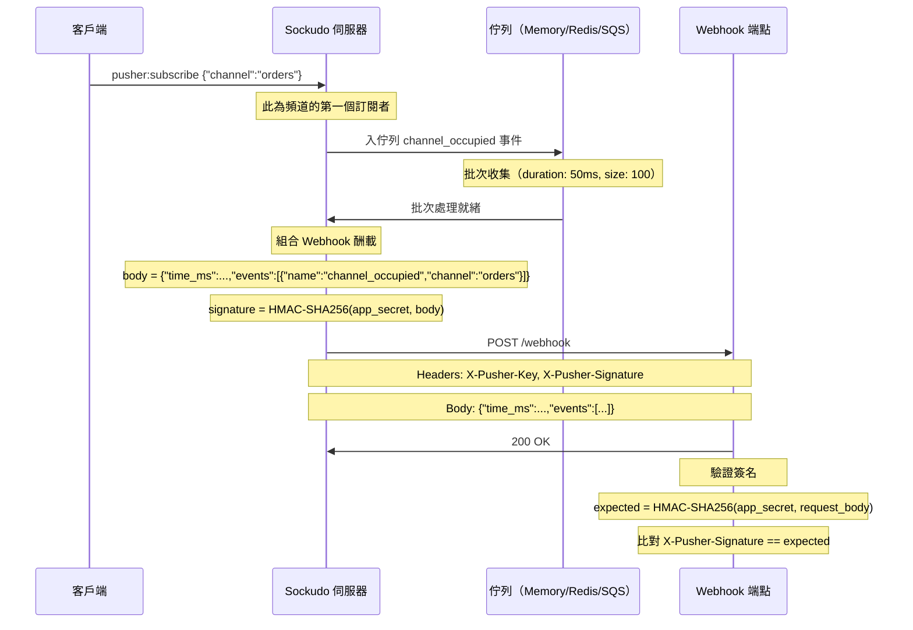

---

## 8. Delta 壓縮流程

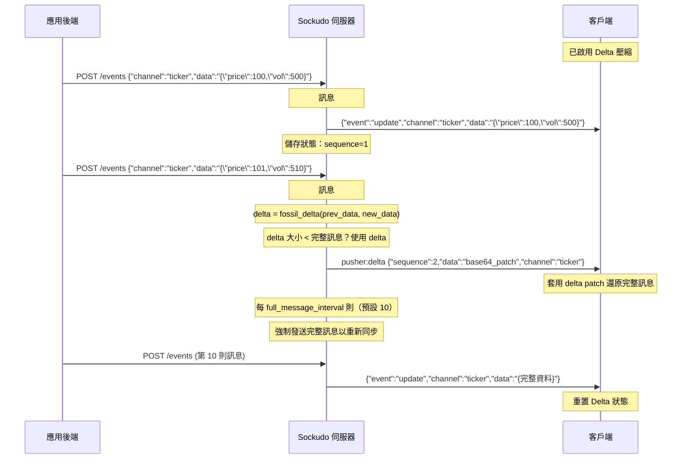

---

## 9. 標籤過濾流程

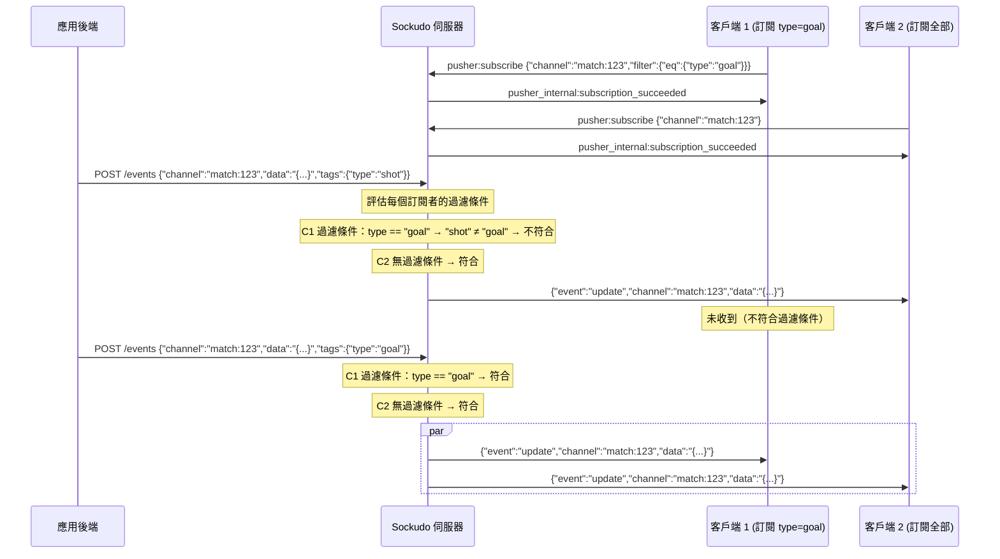

---

## 10. 多節點水平擴展（Redis 適配器）

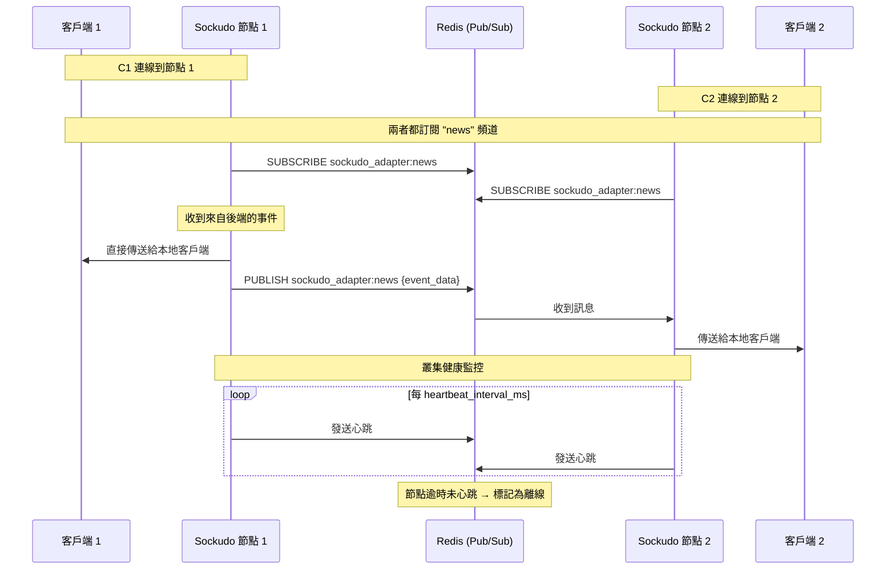

---

## 11. 使用者認證流程

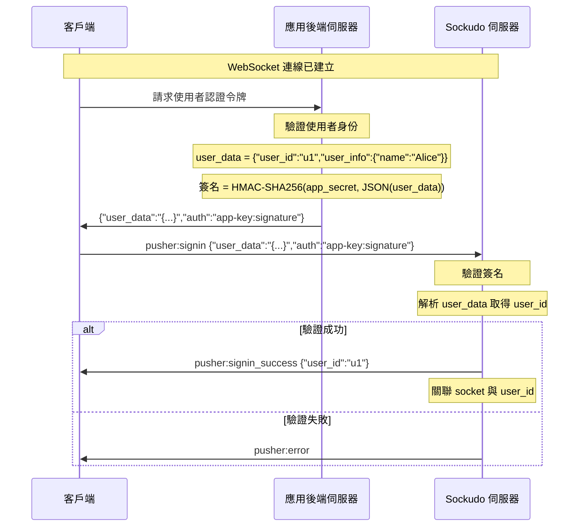

---

## 12. 完整應用整合流程（以 Laravel 為例）

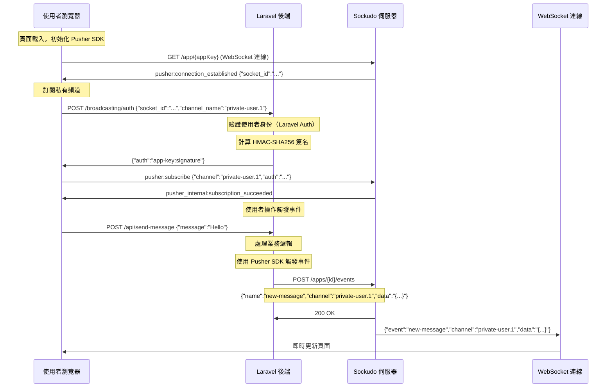
